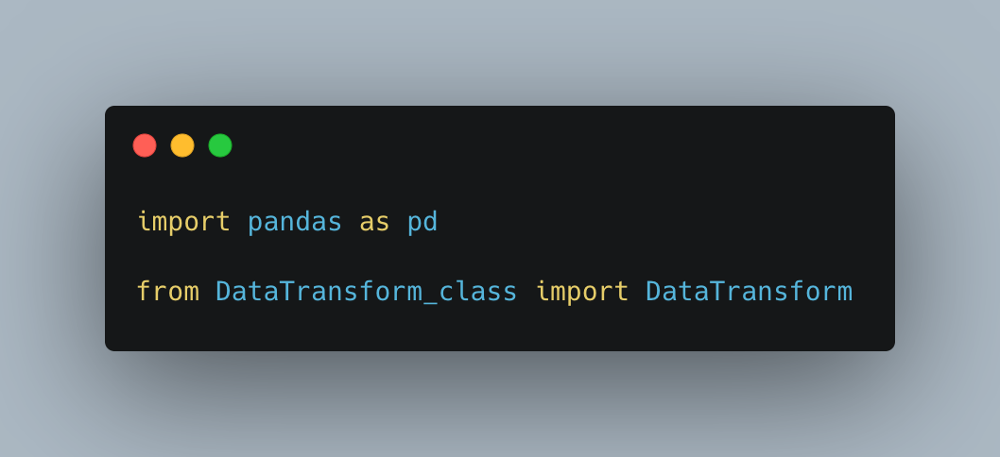
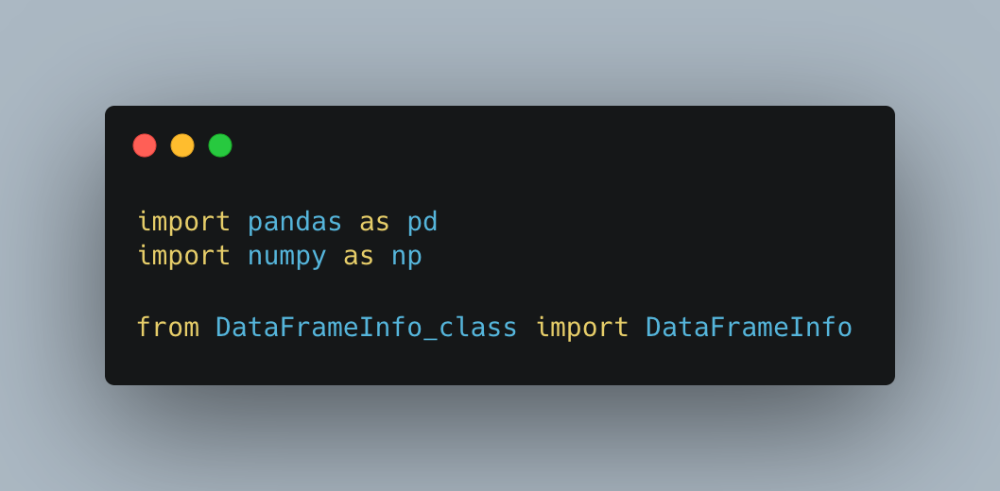
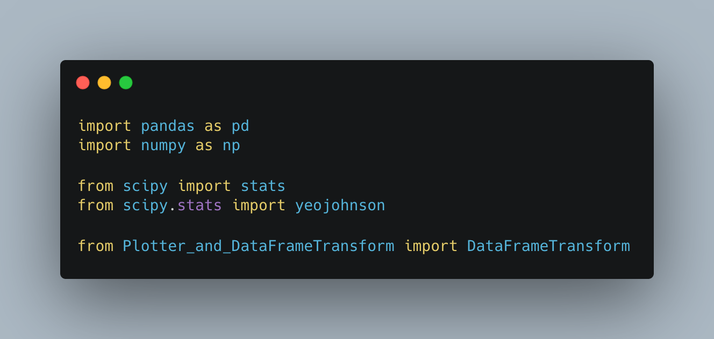
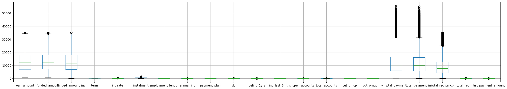
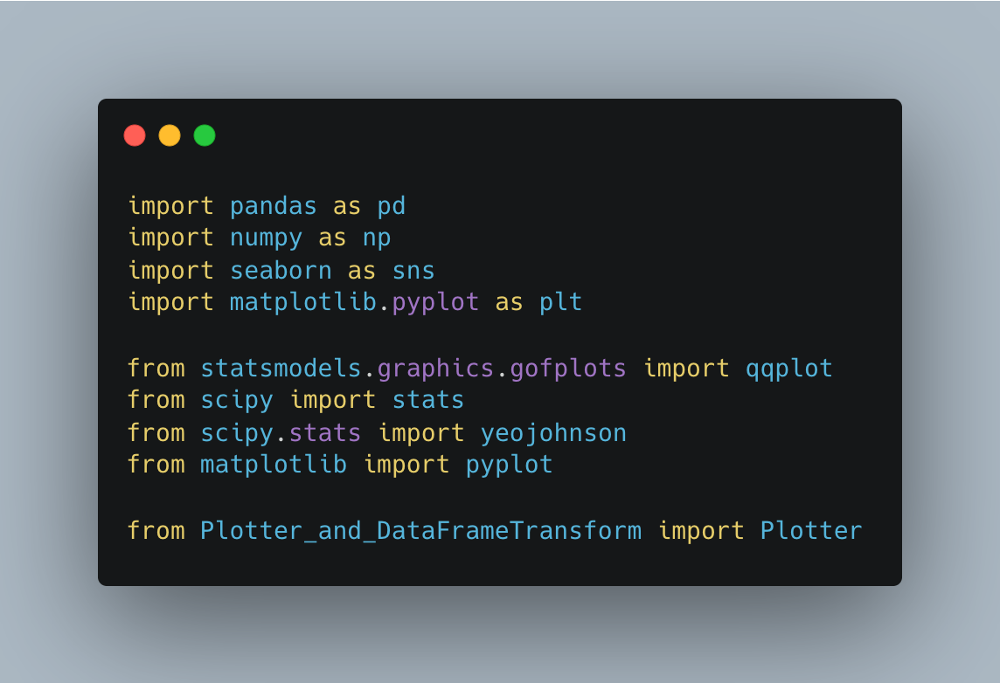

# EDA on Customer Loans in Finance
Loans can be beneficial for individuals, business operations and for the growth of the overall money supply in an economy. Given the importance of loans for both business and economic development, it is essential that loans are provided to individuals that will repay their loans in full. To effectively create an informed decision on which loans should or should not be approved, this project investigates loan data, performs exploratory data analysis and visualises the data to provide helpful insights.

# Project Outline
1. [Extracting Data from the Cloud](https://github.com/shhrreeyyaa/exploratory-data-analysis---customer-loans-in-finance?tab=readme-ov-file#1-extracting-data-from-the-cloud)
2. [Exploratory Data Analysis (EDA)](https://github.com/shhrreeyyaa/exploratory-data-analysis---customer-loans-in-finance?tab=readme-ov-file#2-exploratory-data-analysis-eda)
3. [Analysis and Visualisation](https://github.com/shhrreeyyaa/exploratory-data-analysis---customer-loans-in-finance?tab=readme-ov-file#3-analysis-and-visualisation)

## 1. Extracting Data from the Cloud
In order to begin the data analysis, I first needed to extract and clean the data. To do this, I created a class called __RDSDatabaseConnector__ in a new file, db_utils.py, which has the sole purpose of extracting the data. Other than pandas, all other necessary packages for this class are already coded to be imported within the method that they are required.

To create an instance for this class and use it's methods, one needs to first create a yaml file, which contains the credentials of the RDS database that you want to connect to. Make sure that the credentials contain the following information:
- RDS_HOST
- RDS_PASSWORD
- RDS_USER
- RDS_DATABASE
- RDS_PORT

There are a total of 5 different methods contained in the __RDSDatabaseConnector__ class:
1. init
2. load_credentials
3. initialise_SQLAlchemy
4. data_to_Pandas_df
5. df_to_csv

Below is a brief outline on each method. Further information on the RDSDatabaseConnector class can be found using help(RDSDatabaseConnector) after the class has been imported to your computer.

### 1. init
This magic method simply initialises the instance attributes with the values that have be passed as arguments. In the RDSDatabaseConnector class, there is only one attribute initialised in this method, which is 'self.credentials'. 

### 2. load_credentials
The purpose of this method is to load the credentials yaml file so that this information can later be used to connect to the RDS. I had to create a credentials yaml file with the necessary information and import the yaml Python package prior to this step.

### 3. initialise_SQLAlchemy
Now that the the credentials had been loaded in Python, the next step was to use the information to connect to the SQLAlchemy engine and load the data. In order to create an SQLAlchemy, the engine package first needed to be imported from sqlalchemy.

### 4. data_to_Pandas_df
Finally, the required data had been extracted. However the format of the data at this point was not ideal for data analysis, hence a method was created to convert this data to a pandas dataframe. This resulted in the data being encompassed in a variable name called 'pandas_df'.

### 5. df_to_csv
Unfortunately, a pandas dataframe can only be viewed in Python and so is not easily accessible after each coding session. To solve this inconvenience, I converted the data to a csv, which means that the data can be saved locally on my computer and can also be accessible to any peers that I wish to share the raw data with. 

## 2. Exploratory Data Analysis (EDA)
Prior to carrying out EDA, I familiarised myself with the data, which can be seen in the [familiarise_with_data.ipynb](https://github.com/Shreeya-R/exploratory-data-analysis---customer-loans-in-finance/blob/6488d21a46412a42aba677cf7a0348b06a2f8e29/Notebooks%20for%20Explanations/familiarise_with_data.ipynb) notebook.

To carry out the EDA of this financial dataset, I created the following 4 classes:
1. DataTransform
2. DataFrameInfo
3. DataFrameTransform
4. Plotter

Below, I have explained each class in further detail. To see more information about each of these classes and their methods, see the docstrings for them through help(*insert class name here*).

### 1. DataTransform
The purpose of this class is to alter columns so that they are in their correct format, which involves changing the datatypes of the variables. Here is a list of the different datatypes that the object variables can be converted to in this class:
- Datetime
- Boolean
- Category
- Integer

In addition, the class provides the option to apply all the conversions in one go using the 'all_transformations' method.

#### Installation
To install this class:

### 2. DataFrameInfo
__DataFrameInfo__ class contains methods to generate useful information about the data, in particular statistical values and other properties of the data. 

The statistical calculations included in this class are:
- Mean
- Median
- Mode
- Standard deviation
- Skew

Furthermore, this class contains methods for:
- Number of distinct values in the categorical columns
- Shape of the dataframe
- Percentage of null values in the columns

Overall, the __DataFrameInfo__ class gives an insight the data, which will be very useful for cleaning and removing data in the next step of this project.

#### Installation
To install this class:

### 3. DataFrameTransform
Removing unnecessary data and inputing data for missing values is a very important step in EDA. Fortunately, I already explored the data in the previous __DataFrameInfo__ class, so now the purpose of the __DataFrameTransform__ class is to apply the changes that need to be made.

There are 3 types of methods contained in this class:
1. Dropping and inputing values
2. Resolving Skew
3. Finding and removing outliers

#### 1. Dropping and Inputing Values
In these methods, values haves been dropped or inputted based on their column being null, missing, zero or a single value column. 

All inputed values are based either on the mean or median of the column. To help decide whether to input the mean or median, I followed this guideline:
- __Median__, when variable is numerical or skewed.
- __Mean__, when variable is numerical and not skewed. 
- __Mode__, when variable is numerical or categorical.

I did not have to use the mode method due to the categorical columns having a low amount of missing values, so it was more convenient to remove the row they appeared in, especially as the dataset is large.

#### 2. Resolving Skew
Prior to resolving skew, I needed to find out which variables were skewed through creating histograms using the __Plotter__ class. See more about this method in the __Plotter__ class section below.

I used 3 different methods to determine how to resolve the skewness of variable:
- __Log__ 
- __Box-Cox__ 
- __Yeojohnson__

See more on the skewness and deciding the best method in the [plotter_dataframetransform.ipynb](https://github.com/Shreeya-R/exploratory-data-analysis---customer-loans-in-finance/blob/6488d21a46412a42aba677cf7a0348b06a2f8e29/Notebooks%20for%20Explanations/plotter_dataframetransform.ipynb) notebook.

#### 3. Finding and Removing Outliers
I chose to use the upper fence and lower fence method with the IQR (inter quartile range) to classify outliers. To do so I used the following formulas:
- IQR = Q3 - Q1
- Upper Fence = Q3 + (1.5 * IQR)
- Lower Fence = Q1 - (1.5 * IQR)

Any values that lie above the upper fence or below the lower fence have been classified as outliers and hence were removed using the method in the __DataFrameTransform__ class.

#### Installation
To install this class:

### 4. Plotter
Any visualisations required during the EDA process are all contained within the __Plotter__ class. This includes the graphical representations that aid in deciding changes to be made to the data in the __DataFrameTransform__ class.

The different purposes of the visualisations provided by the __Plotter__ class are to:
1. Check normality
2. Visualise missing values
3. Correct skewness
4. Find outliers

#### 1. Check Normality
Identifying how close a variable follows a normal distrbution can easily be determined by visualising. This class provides 2 graphical representations to visualise normality, which is a histogram and a Q-Q plot. It is not suffficient to simply look at the statistical calcualtion of skew as the value may indicate a normal distribution, but the graphical representation can provide a very different story. Therefore, it is important to carry out the visualisation of skew through histograms and Q-Q plots.

#### 2. Visualise Missing Values
When looking for missing values, it is good to create a matrix to find the variables with missing values as this gives you an overview of all variables and their missing values. This visualisation can also be used once values have been inputed in place iof the missing values to see if the transformation worked and any missing values that remain.

#### 3. Correct Skewness
Skewness indicates that a variable does not follow a normal distribution. This is not ideal for data analysis as this can lead to biased models and inaccurate results, hence and skewed data should be normalised to provide optimal results.

There are 3 methods for correcting skew and it is useful to plot the variables after a potential normilisation method has been performed so that one can compare the variable to it's original skewed version. Again, a more in depth view on these 3 methods has been shown in the [plotter_dataframetransform.ipynb](https://github.com/Shreeya-R/exploratory-data-analysis---customer-loans-in-finance/blob/6488d21a46412a42aba677cf7a0348b06a2f8e29/Notebooks%20for%20Explanations/plotter_dataframetransform.ipynb) notebook.

#### 4. Find Outliers
Like with normality, sometimes simply using the upper fence and lower fence can provide inaccurate information on the presence of outliers. So, seeing a visual of the spread of data through a boxplot is ideal to check that the outliers found truly are outliers and do not follow the trend like the rest of the data.

#### Installation
To install this class:

## 3. Analysis and Visualisation
Now that the data has been cleaned and the exploratory data analysis is over. The final part of this project involves analysis and visualisation, which provides deeper insights to the data with answers to useful questions. In total, there are 5 insights to take away from this section:
1. What is the current state of the loans?
2. What is the percentage of loans lost to the company?
3. What is the projected loss?
4. What is the possible loss?
5. What are the possible indicators of loss?

The above questions have been explored, answered and visualised in the [analysis_visualisation.ipynb](https://github.com/Shreeya-R/exploratory-data-analysis---customer-loans-in-finance/blob/6488d21a46412a42aba677cf7a0348b06a2f8e29/Notebooks%20for%20Explanations/analysis_visualisation.ipynb) notebook.
